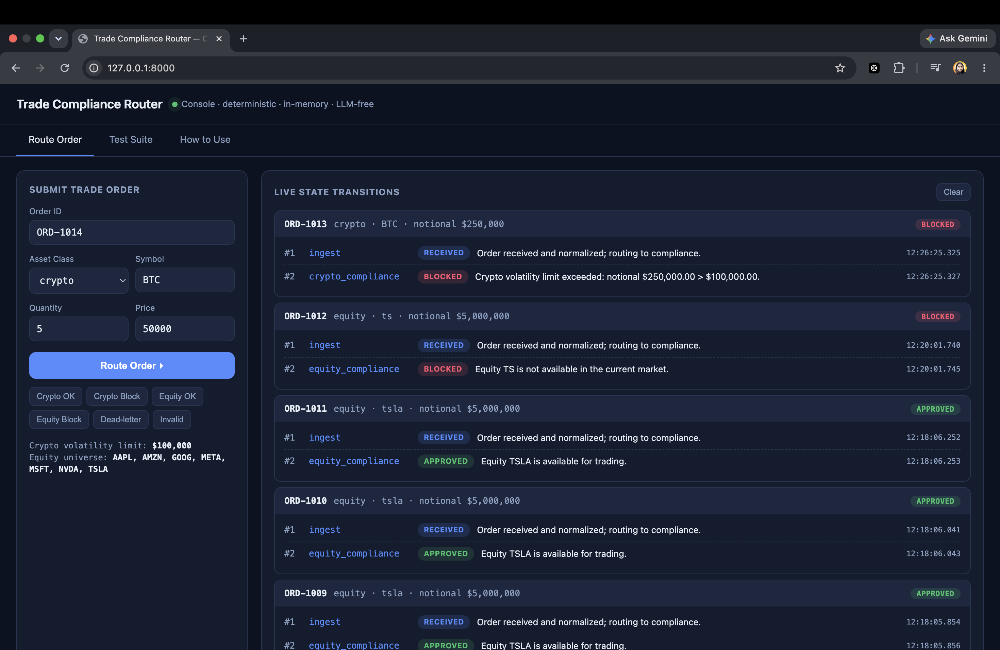

# Financial Trade Compliance Router


A low-latency, **deterministic** trade compliance router built on
[LangGraph](https://langchain-ai.github.io/langgraph/). It ingests raw trade
orders, routes them through regulatory checks, and streams internal graph-state
transitions in real time for a compliance monitoring dashboard.

## Design constraints

- **No LLM on the decision path.** All routing and evaluation is explicit,
  programmatic, and deterministic — required for regulatory auditability and
  ultra-low-latency SLAs.
- **No database.** Graph configuration and execution memory live entirely
  in-memory via LangGraph's `MemorySaver` checkpointer.
- **Real-time streaming.** Execution uses LangGraph's native `.stream()`;
  structured events are emitted as each node completes.

## Topology

```
START → ingest → ┬─ crypto_compliance → END   (asset_class == "crypto")
                 ├─ equity_compliance → END   (asset_class == "equity")
                 └─ dead_letter        → END   (anything else → auto-blocked)
```

- **crypto_compliance** — blocks if notional > `$100,000` (volatility limit).
- **equity_compliance** — blocks symbols outside the in-memory market universe.
- **dead_letter** — fail-safe: auto-blocks unrecognized asset classes.

## Install

```bash
pip install -r requirements.txt
```

## Run the demo (CLI)

```bash
python -m compliance_router
```

## Run the web dashboard

A real-time monitoring dashboard streams each graph-state transition over
Server-Sent Events.

```bash
python -m compliance_router.web          # serves http://127.0.0.1:8000
# or: uvicorn compliance_router.web:app --reload
```

Open <http://127.0.0.1:8000>, submit a trade order (or use a preset), and watch
the live transitions stream in.

### HTTP API

| Method | Path                   | Purpose                                        |
|--------|------------------------|------------------------------------------------|
| GET    | `/`                    | Monitoring dashboard (HTML)                    |
| GET    | `/api/config`          | Current in-memory rule configuration           |
| POST   | `/api/orders`          | Route one order → final JSON result            |
| POST   | `/api/orders/stream`   | Route one order → SSE stream of transitions    |

## How to use — walkthrough with examples

### 1. Start the server

```bash
python -m compliance_router.web        # http://127.0.0.1:8000
```

### 2. Use the dashboard (no code)

Open <http://127.0.0.1:8000>. There are two tabs:

- **Route Order** — fill in an order (or click a preset like *Crypto Block*),
  press **Route Order ▸**, and watch each graph node light up live:
  `ingest → crypto_compliance → APPROVED/BLOCKED`.
- **Test Suite** — press **Run all tests ▸** to fire all 8 scenarios at the
  API. You get a pass/fail grid, per-order latency, and a **view raw** toggle
  that expands the exact JSON the backend returned.

### 3. Call the API directly (curl)

**Example A — crypto trade within the volatility limit → APPROVED**

```bash
curl -X POST http://127.0.0.1:8000/api/orders \
  -H 'Content-Type: application/json' \
  -d '{"order_id":"C1","asset_class":"crypto","symbol":"BTC","quantity":1,"price":50000}'
```
```json
{"order_id":"C1","asset_class":"crypto","symbol":"BTC","notional":50000.0,
 "status":"APPROVED","reason":"Crypto trade within volatility limit (notional $50,000.00).",
 "routed_to":"crypto_compliance"}
```

**Example B — crypto trade over $100k → BLOCKED**

```bash
curl -X POST http://127.0.0.1:8000/api/orders \
  -H 'Content-Type: application/json' \
  -d '{"order_id":"C2","asset_class":"crypto","symbol":"BTC","quantity":5,"price":50000}'
```
```json
{"order_id":"C2","status":"BLOCKED",
 "reason":"Crypto volatility limit exceeded: notional $250,000.00 > $100,000.00.",
 "routed_to":"crypto_compliance", ...}
```

**Example C — unknown asset class → dead-letter (auto-blocked)**

```bash
curl -X POST http://127.0.0.1:8000/api/orders \
  -H 'Content-Type: application/json' \
  -d '{"order_id":"F1","asset_class":"forex","symbol":"EURUSD","quantity":1000,"price":1.1}'
```
```json
{"order_id":"F1","status":"BLOCKED",
 "reason":"Unrecognized asset class 'forex' — automatically blocked.",
 "routed_to":"dead_letter", ...}
```

**Example D — live streaming of state transitions (SSE)**

```bash
curl -N -X POST http://127.0.0.1:8000/api/orders/stream \
  -H 'Content-Type: application/json' \
  -d '{"order_id":"E1","asset_class":"equity","symbol":"AAPL","quantity":100,"price":180}'
```
```
event: transition
data: {"order_id":"E1","sequence":1,"node":"ingest","status":"PENDING", ...}

event: transition
data: {"order_id":"E1","sequence":2,"node":"equity_compliance","status":"APPROVED", ...}

event: done
data: {"order_id":"E1"}
```

**Example E — invalid order is rejected deterministically**

```bash
curl -X POST http://127.0.0.1:8000/api/orders \
  -H 'Content-Type: application/json' \
  -d '{"order_id":"B1","asset_class":"crypto","symbol":"BTC","quantity":0,"price":100}'
```
```json
{"error":"invalid_order","detail":[{"loc":["quantity"],"msg":"Input should be greater than 0", ...}]}
```

### Example scenarios at a glance

| Order | asset_class | symbol | qty × price | notional | Outcome | Routed to |
|-------|-------------|--------|-------------|----------|---------|-----------|
| C1 | crypto | BTC | 1 × 50,000 | $50,000 | ✅ APPROVED | crypto_compliance |
| C2 | crypto | BTC | 5 × 50,000 | $250,000 | ⛔ BLOCKED (over limit) | crypto_compliance |
| E1 | equity | AAPL | 100 × 180 | $18,000 | ✅ APPROVED | equity_compliance |
| E2 | equity | ZZZZ | 100 × 10 | $1,000 | ⛔ BLOCKED (not available) | equity_compliance |
| F1 | forex | EURUSD | 1000 × 1.1 | $1,100 | ⛔ BLOCKED (unknown class) | dead_letter |
| B1 | crypto | BTC | 0 × 100 | — | ⛔ REJECTED (invalid) | — (validation) |

> Tip: the boundary is exclusive — a crypto notional of **exactly $100,000 is
> APPROVED**; only strictly greater is blocked.

## Use as a library

```python
from compliance_router import ComplianceRouter, TradeOrder

router = ComplianceRouter()
order = TradeOrder(order_id="C1", asset_class="crypto",
                   symbol="BTC", quantity=1, price=50_000)

# Stream live state transitions (dashboard feed):
for event in router.stream(order):
    print(event.sequence, event.node, event.status, event.reason)

# Or get the final structured result:
result = router.process(order)
print(result.status, result.routed_to)
```

## Configuration

In-memory only; overridable via environment variables:

| Variable                   | Meaning                                  | Default      |
|----------------------------|------------------------------------------|--------------|
| `CRYPTO_VOLATILITY_LIMIT`  | Max crypto notional before blocking      | `100000`     |
| `EQUITY_MARKET_AVAILABLE`  | Comma-separated tradable equity symbols  | sample list  |

## Tests

```bash
pytest
```

## Layout

```
compliance_router/
  config.py    # in-memory, immutable rule configuration
  models.py    # validated TradeOrder, internal TradeState, ComplianceResult
  nodes.py     # deterministic node functions + routing logic
  router.py    # compiled StateGraph + streaming router API
  web.py       # FastAPI app: REST + SSE streaming endpoints
  static/
    index.html # real-time monitoring dashboard (vanilla JS)
  __main__.py  # demo / CLI entry point
tests/
  test_router.py
```
